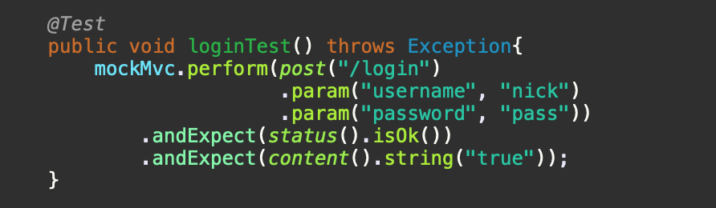
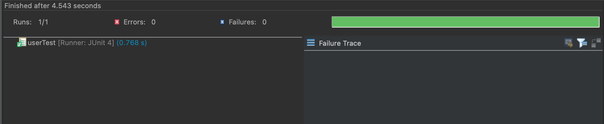
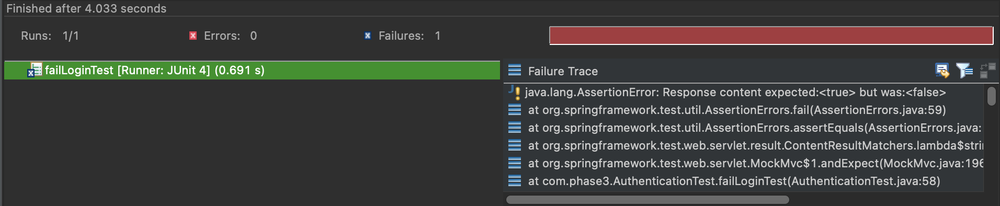

# Handling User Authentication

This is a Spring MVC application that performs successful JUnit testing...

## Features

	- Simulates basic login authentication in a web application
	- Injects test values from test file
	- Authentication operations include login, logout, and retreiving a user
	- Application was produced using TDD

## Installation

	- Clone and pull source code from provided github repository
	- Run the SpringApplicationTest

## Code

	https://github.com/nicholas-auyeung/Handling-User-Authentication

## Flow

1. Go to https://start.spring.io/

2. Enter the appropriate spring project settings:

	Project: Project
	Language: Java
	Spring Boot: 2.4.1
	Enter package names
	Packaging: Jar
	Java: 8

3. Enter the appropriate spring project dependencies:

	Lombok
	Spring Web

4. Import into Eclipse EE as maven project

5. Inside 'HandlingAuth' maven project...src/test/java inside the already created 'com.phase3' package, create Authentication JUnit test class.

6. Define proper mockmvc and webapplicationcontext objects.

7. Create first test, test login and implement test logic.

8. Create required logic to run test.

9. Inside src/main/java create two packages 'controller' and 'model'.

10. Inside 'model' package define User class model.

11. Implement User class.

12. Inside 'controller' package define authentication controller.

13. Implement login controller functions.

14. Add appropriate annotations to the application.

15. Run Junit test.

16. Write a new test, logout test.

17. Inside 'AuthenticationController' define the logout function.

18. Run Junit test.

19. Rinse and repeat steps (16-18) for the remaining tests.

## Usage
Once imported into Eclipse IDE, navigate to 'src/test/java/com.phase3/AuthenticationTest.java.
	
	Select a test to run
	Right click function name of desired test and select 'Run as -> Junit test case'

	If test case is passed you should see a green bar with no errors

	If test case is failed user will see a red bar along with appropriate assertion errors
